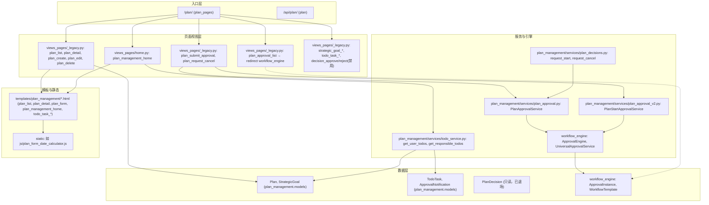

# 计划管理模块 - 结构取证报告（只读，未改代码）

> 取证指令：只取证、不改代码；产出结构图 + 证据路径。

---

## A. 模块边界与入口总览

### App 位置与命名空间

| 项目 | 路径 / 值 | 证据 |
|------|------------|------|
| 页面 URL 根 | `path('plan/', include(..., namespace='plan_pages'))` | `backend/config/urls.py` L122 |
| 页面 urls | `backend/apps/plan_management/urls_pages.py`，`app_name = "plan_pages"` | `urls_pages.py` L7 |
| API 根 | `path('api/plan/', include(..., namespace='plan'))` | `backend/config/urls.py` L94 |
| API urls | `backend/apps/plan_management/urls.py`，`app_name = 'plan'` | `urls.py` L17 |

### 主要 URL 列表（按功能分组）

**首页**
| URL（name） | View | 证据（文件:行） |
|-------------|------|-----------------|
| `plan/`、`plan/home/` → `plan_management_home` | `views_pages.plan_management_home` | `urls_pages.py` L11-12；实现在 `views_pages/home.py` L21，覆盖自 `__init__.py` L29 |

**计划**
| URL（name） | View | 证据 |
|-------------|------|------|
| `plan/plans/` → `plan_list` | `views_pages.plan_list` | `urls_pages.py` L15；`_legacy.py` L69 `def plan_list` |
| `plan/plans/create/` → `plan_create` | `views_pages.plan_create` | `urls_pages.py` L19；`_legacy.py` L536 |
| `plan/plans/<id>/` → `plan_detail` | `views_pages.plan_detail` | `urls_pages.py` L20；`_legacy.py` 取 plan 约 L984-991，render L1284-1285 |
| `plan/plans/<id>/edit/` → `plan_edit` | `views_pages.plan_edit` | `urls_pages.py` L21 |
| `plan/plans/<id>/delete/` → `plan_delete` | `views_pages.plan_delete` | `urls_pages.py` L22 |
| `plan/plans/decompose/`、`plan/plans/<id>/decompose/` | `plan_decompose_entry`、`plan_decompose` | `urls_pages.py` L23-24 |
| `plan/plans/track/`、`plan/plans/<id>/execution/` | `plan_track_entry`、`plan_execution_track` | `urls_pages.py` L25、L30 |
| `plan/plans/<id>/goal-alignment/` | `plan_goal_alignment` | `urls_pages.py` L26 |
| `plan/plans/<id>/progress/update/`、`plan/plans/<id>/issues/`、`plan/plans/<id>/complete/` | `plan_progress_update`、`plan_issue_list`、`plan_complete` | `urls_pages.py` L31-33 |

**目标（战略目标）**
| URL（name） | View | 证据 |
|-------------|------|------|
| `plan/strategic-goals/` → `strategic_goal_list` | `views_pages.strategic_goal_list` | `urls_pages.py` L48；`_legacy.py` L311 |
| `plan/strategic-goals/create/`、`<id>/`、`<id>/edit/`、`<id>/delete/` 等 | 对应 `strategic_goal_*` | `urls_pages.py` L49-58 |

**待办**
| URL（name） | View | 证据 |
|-------------|------|------|
| `plan/todos/` → `todo_task_list` | `views_pages.todo_task_list` | `urls_pages.py` L73；`_legacy.py` L5094 附近 |
| `plan/todos/<id>/complete/`、`plan/todos/<id>/cancel/` | `todo_task_complete`、`todo_task_cancel` | `urls_pages.py` L74-75 |

**审批 / 决策**
| URL（name） | View | 证据 |
|-------------|------|------|
| `plan/plans/approval/` → `plan_approval_list` | `views_pages.plan_approval_list` | `urls_pages.py` L27；`_legacy.py` L1825-1830：直接 `redirect('workflow_engine:approval_list_pending')` |
| `plan/plans/<id>/submit-approval/` → `plan_submit_approval` | `views_pages.plan_submit_approval` | `urls_pages.py` L36；`_legacy.py` L3932 |
| `plan/plans/<id>/requests/cancel/` → `plan_request_cancel` | `views_pages.plan_request_cancel` | `urls_pages.py` L37；`_legacy.py` 约 L4043+，内部调 `request_cancel` |
| `plan/decisions/<id>/approve/`、`reject/` | `decision_approve`、`decision_reject` | `urls_pages.py` L38-39；`_legacy.py` L4090、L4122：已禁用，直接 redirect + message「旧审批系统已退场」 |

**API（plan namespace）**
| 路径 | View/Set | 证据 |
|------|----------|------|
| `api/plan/plans/`、`strategic-goals/` | `views.PlanViewSet`、`StrategicGoalViewSet` | `urls.py` L21-22 |
| `api/plan/plan-decisions/` | `PlanDecisionViewSet`（只读） | `urls.py` L23；`decision_views.py` L16 |
| `api/plan/plan-decisions/<id>/decide/` | `PlanDecisionDecideAPIView` | `urls.py` L35；`decision_views.py` L35：返回 410 GONE，禁用 |
| `api/plan/stats/plans/`、`stats/goals/` | `PlanStatsAPI`、`GoalStatsAPI` | `urls.py` L25-26 |
| `api/plan/inbox/`、`my-submissions/` | `InboxAPI`、`MySubmissionsAPI` | `urls.py` L27-28 |
| `api/plan/notifications/` 等 | `NotificationListAPI` 等 | `urls.py` L30-33 |

---

## B. 领域对象结构（Domain Map）

### 核心模型清单与关键字段

| 模型 | 表名 | 关键字段（status / owner / org / 关系） | 证据 |
|------|------|----------------------------------------|------|
| **StrategicGoal** | `plan_strategic_goal` | `status`(draft/published/accepted/in_progress/completed/cancelled)、`responsible_person`、`owner`、`participants`、`responsible_department`、`parent_goal`；无 company 字段 | `models.py` L16-166、L124-134 |
| **Plan** | `plan_plan` | `status`(draft/published/in_progress/completed/cancelled/paused/delayed)、`responsible_person`、`owner`、`participants`、`responsible_department`、`related_goal`、`parent_plan`、`company`、`org_department` | `models.py` L724-931 |
| **PlanDecision** | `plan_decision` | `plan` FK、`request_type`(start/cancel)、`decision`(approve/reject)、`requested_by`、`decided_by`、`decided_at`(null=pending)；**save() 禁止新建**（仅历史只读） | `models.py` L1715-1828 |
| **TodoTask** | `plan_todo_task` | `user`、`task_type`、`status`(pending/completed/overdue/cancelled)、`related_object_type`/`related_object_id`、`deadline`；无 company | `models.py` L1911-2024 |
| **ApprovalNotification** | `plan_approval_notification` | `user`、`object_type`/`object_id`、`event`、`is_read` | `models.py` L1836-1907 |
| **PlanStatusLog** / **GoalStatusLog** | 各表 | 记录 status 变更 | `models.py` 约 L1339、L468 |
| **PlanAdjustment** / **GoalAdjustment** | 各表 | 调整申请，与审批引擎联动 | 见 `plan_approval_v2.py` L66-94 |

### 关系图（文本）

```
StrategicGoal (parent_goal → self)
    └── child_goals
    └── related_plans (Plan.related_goal)

Plan (parent_plan → self, related_goal → StrategicGoal)
    └── child_plans
    └── decisions (PlanDecision，已退场只读)
    └── 审批引擎：ContentType(Plan) + object_id → ApprovalInstance（workflow_engine）

TodoTask
    └── related_object_type + related_object_id → Plan | StrategicGoal | todo
```

- **审批**：计划启动/取消 走 **workflow_engine.ApprovalInstance**（WorkflowTemplate code: `plan_start_approval` / `plan_cancel_approval`）；**PlanDecision 已退场**，不再创建新记录，仅历史只读。

---

## C. 请求链路结构图（Request Flow）

### 1) 计划列表页

| 环节 | 证据 |
|------|------|
| **入口** | URL `plan/plans/`，name `plan_pages:plan_list` |
| **View** | `views_pages.plan_list`（`_legacy.py` L69） |
| **权限** | `_permission_granted('plan_management.view', permission_set)`，否则 redirect admin |
| **QuerySet** | `get_plan_qs_for_user(request)` → `apply_company_scope(Plan.objects.all(), request.user)` + `_filter_plans_by_permission(...)`；再按 search/status/level/plan_period/related_goal/responsible/date/risk 过滤、分页 |
| **待审批标识** | 仅 ApprovalInstance：`content_type=Plan, object_id__in=plan_ids, status in pending/in_progress`，按 `workflow__code` 区分 start/cancel（PlanDecision 已不查） |
| **Template** | `plan_management/plan_list.html` |
| **静态** | 未在取证中单独列；列表页通常共用 list 基模/JS |

- 证据：`_legacy.py` L82-86（plans = get_plan_qs_for_user）、L166-191（ApprovalInstance 批量）、L304-307（render）；`menu.py` L52-58（get_plan_qs_for_user = apply_company_scope + _filter_plans_by_permission）。

### 2) 计划详情页

| 环节 | 证据 |
|------|------|
| **入口** | URL `plan/plans/<plan_id>/`，name `plan_pages:plan_detail` |
| **View** | `views_pages.plan_detail`（`_legacy.py` 约 L979 起） |
| **权限** | `_permission_granted('plan_management.view', permission_set)`；取数 `get_object_or_404(get_plan_qs_for_user(request).select_related(...).prefetch_related(...), id=plan_id)` |
| **数据** | Plan + PlanProgressRecord、PlanStatusLog、PlanIssue、inactivity_logs、child_plans、Attachment、ApprovalInstance（content_type=Plan, object_id=plan.id）、AuditLog |
| **提交审批/取消** | can_submit_approval / can_request_cancel 由「create 或负责人 + 状态 + 无 pending ApprovalInstance」决定；**不查 PlanDecision** |
| **Template** | `plan_management/plan_detail.html` 或 `plan_detail_three_column.html` |
| **输出** | render(request, template, context) |

- 证据：`_legacy.py` L978-991（权限与 get_plan_qs_for_user）、L1040-1064（ApprovalInstance）、L1117-1195（pending 与 can_submit/can_request_cancel）、L1284-1285（template）。

### 3) 创建计划

| 环节 | 证据 |
|------|------|
| **入口** | URL `plan/plans/create/`，name `plan_pages:plan_create` |
| **View** | `views_pages.plan_create`（`_legacy.py` L536） |
| **权限** | `_permission_granted('plan_management.plan.create', permission_set)` |
| **表单** | `PlanForm`、`PlanItemFormSet`（prefix='planitems'）；周计划重复校验：同人同周 `Plan.objects.filter(plan_period='weekly', responsible_person, start_time 在当周)` |
| **Workflow 上下文** | `WorkflowTemplate.objects.filter(status='active', applicable_models__contains=['plan'])` 注入 `available_workflows`、`workflow_details_json` |
| **保存** | 通过 form/formset 创建 Plan（及子计划）；新建计划 status 由 Plan 默认/业务在 save 或后续逻辑设定（如日/周 published、其他 draft） |
| **Template** | `plan_management/plan_form.html` |
| **前端** | `context['form_js_file'] = 'js/plan_form_date_calculator.js'`（`_legacy.py` 多处） |

- 证据：`_legacy.py` L539-562（form/formset）、L617-632（WorkflowTemplate）、L627-633（form_js_file）、L633/836 等（render plan_form.html）。

### 4) 提交审批（计划启动）

| 环节 | 证据 |
|------|------|
| **入口** | POST `plan/plans/<plan_id>/submit-approval/`，name `plan_pages:plan_submit_approval` |
| **View** | `views_pages.plan_submit_approval`（`_legacy.py` L3932） |
| **权限** | `plan_management.plan.create` 或 `plan.responsible_person == request.user`；取数 `get_plan_or_404(request, plan_id)`（即 get_plan_qs_for_user + id） |
| **状态** | 仅允许 `draft` 或 `cancelled`；若 cancelled 先改为 draft 并写 PlanStatusLog |
| **重复提交** | 查 ApprovalInstance：content_type=Plan, object_id=plan.id, workflow__code='plan_start_approval', status in pending/in_progress |
| **服务** | `PlanStartApprovalService().submit_approval(obj=plan, applicant=request.user, comment=...)`（`plan_approval_v2.py`）；其基类 `UniversalApprovalService` 内部走 workflow_engine |
| **创建记录** | **不创建 PlanDecision**；创建 **workflow_engine.ApprovalInstance**（由 ApprovalEngine/UniversalApprovalService 创建） |
| **通知** | 文档/代码中审批结果走通知中心，不依赖 PlanDecision |

- 证据：`_legacy.py` L3936-4019（权限、状态、Existing 检查、cancelled→draft、PlanStartApprovalService）；`plan_approval_v2.py` L14-38（PlanStartApprovalService.WORKFLOW_CODE='plan_start_approval'）；`plan_approval.py` L78-135（PlanApprovalService.submit_start_approval → ApprovalEngine.start_approval）。

### 5) 首页待办卡片

| 环节 | 证据 |
|------|------|
| **入口** | URL `plan/` 或 `plan/home/`，view `plan_management_home`（`home.py`） |
| **数据来源** | `get_user_todos(request.user, filter_*)`、`get_responsible_todos(...)`（`todo_service.get_user_todos` / `get_responsible_todos`） |
| **表/来源** | ① **TodoTask**：`TodoTask.objects.filter(user=..., status__in=['pending','overdue'])`；② **查询生成待办**：目标/计划的「待接收、待执行、今日应执行、风险」等由 service 内查 StrategicGoal/Plan 动态生成条目 |
| **待办项结构** | 每项含 type、title、description、priority、**url**（跳转）、object、created_at、deadline、is_overdue；数据库待办带 db_todo_id 等便于闭环 |
| **跳转** | url 由 `todo_service` 内 `reverse('plan_pages:...')` 生成，如 plan_detail、plan_create、strategic_goal_detail、plan_execution_track、plan_list、strategic_goal_list 等（见 todo_service.py 多处 reverse） |
| **Template** | `plan_management/plan_management_home.html`，继承 `shared/module_home_base.html`；首页卡片区用 `_first_row_cards.html` 等 partial |
| **静态** | 模板内 ``；样式在模板内联（与宪法“禁止 style”可能需后续治理） |

- 证据：`home.py` L181-184（import get_user_todos, get_responsible_todos）、L269-276（user_todos）、L294-365（todo_items 分类与 url/meta）；`todo_service.py` L274-376（get_user_todos 先查 TodoTask 再合并查询待办）、L674-737 等（url=reverse('plan_pages:...')）。

### 6) 计划取消请求（简要）

- 入口：POST `plan/plans/<id>/requests/cancel/` → `plan_request_cancel`。
- 权限与取数：同详情/提交审批（create 或负责人）；检查 plan.status==in_progress 且无 pending 取消 ApprovalInstance。
- 服务：`plan_decisions.request_cancel(plan, request.user, reason)` → 内部 `PlanApprovalService.submit_cancel_approval(...)` → ApprovalEngine.start_approval（**不创建 PlanDecision**）。
- 证据：`_legacy.py` 约 L4043-4086；`plan_decisions.py` L66-99。

---

## D. 横切关注点

### 权限检查点

| View/入口 | 权限判断方式 | 证据 |
|-----------|--------------|------|
| plan_management_home | `plan_management.view` 必须；`plan_management.plan.manage` 或 `manage_goal` 决定是否显示管理视图 | `home.py` L38-47、L428 |
| plan_list | `plan_management.view`，否则 redirect admin | `_legacy.py` L67-69 |
| plan_detail | `plan_management.view`；取数 `get_plan_qs_for_user(request)`（公司+权限） | `_legacy.py` L978-991 |
| plan_create | `plan_management.plan.create` | `_legacy.py` L536-537 |
| plan_edit / plan_delete | `plan_management.plan.manage` 或负责人；取数需与 list 一致（当前部分历史代码曾用裸 get_object_or_404(Plan, id=)，见 B0_PLAN_AUDIT_D） | `_legacy.py` 多处；文档 B0_PLAN_AUDIT_D.md |
| plan_submit_approval | `plan_management.plan.create` 或 plan.responsible_person == request.user；取数 get_plan_or_404 | `_legacy.py` L3936-3937 |
| plan_approval_list | 无额外权限，直接 redirect workflow_engine | `_legacy.py` L1825-1830 |
| strategic_goal_list | `plan_management.manage_goal`；列表过滤 view_all / view_assigned / level+负责人 | `_legacy.py` L313-341 |
| todo_task_list | 仅当前用户待办：TodoTask.objects.filter(user=request.user) | `_legacy.py` L5108 |
| decision_approve / decision_reject | 已禁用；原 `plan_management.approve_plan` 或 is_superuser | `_legacy.py` L4090-4095、L4122-4127 |

- 权限码来源：`get_user_permission_codes(request.user)`（`system_management.services`）；`_permission_granted(code, permission_set)` 来自 `backend.core.views`（`_legacy.py` L15-16、common 等）。

### 状态机入口

- **Plan.status**：变更应通过裁决器/服务层（如 adjudicate_plan_status、recalc、或审批通过后引擎回调）；文档 B0_PLAN_AUDIT_B_C 指出 views 中通过 adjudicator 写 status，禁止随意直接写 status。
- **直接写字段**：`plan_submit_approval` 中 cancelled→draft 时 `plan.status='draft'` + `plan.save(update_fields=['status'])` 并写 PlanStatusLog（`_legacy.py` L3974-3982）；创建计划时由表单/默认值写入初始 status。
- **StrategicGoal.status**：表单与业务逻辑中变更；无统一单一“状态机方法”的集中证据，需下钻。

### 两套系统并行（审批/待办）

| 机制 | 数据表 / 入口 | 当前用途 |
|------|----------------|----------|
| **审批引擎（主）** | workflow_engine：WorkflowTemplate、ApprovalInstance；计划绑定 code `plan_start_approval` / `plan_cancel_approval` | 计划启动/取消审批；计划审批列表页重定向到 `workflow_engine:approval_list_pending` |
| **PlanDecision（已退场）** | plan_management.PlanDecision；save() 禁止新建；decision_approve/decision_reject 与 API decide 返回 410/redirect | 仅历史只读；不再作为待办或审批来源 |

- 待办：**单一来源**为「TodoTask 表 + todo_service 查询生成待办」；首页待办卡片与待办列表均来自 `get_user_todos` / `get_responsible_todos`，**不**从 PlanDecision 或 ApprovalInstance 直接生成“待办条”（审批待办在 workflow_engine 侧）。

---

## E. 结构图（最终汇总）



### 缩进树（关键节点 + 文件/符号）

```
入口层
├── plan/ (plan_pages)
│   ├── "" | "home/" → views_pages/home.py :: plan_management_home
│   ├── plans/ → views_pages/_legacy.py :: plan_list  → get_plan_qs_for_user → Plan → plan_list.html
│   ├── plans/create/ → _legacy :: plan_create       → PlanForm, PlanItemFormSet → plan_form.html
│   ├── plans/<id>/ → _legacy :: plan_detail          → get_plan_qs_for_user, ApprovalInstance → plan_detail*.html
│   ├── plans/<id>/submit-approval/ → _legacy :: plan_submit_approval
│   │   → PlanStartApprovalService (plan_approval_v2) → workflow_engine.ApprovalEngine → ApprovalInstance
│   ├── plans/<id>/requests/cancel/ → _legacy :: plan_request_cancel
│   │   → plan_decisions.request_cancel → PlanApprovalService.submit_cancel_approval → ApprovalInstance
│   ├── plans/approval/ → _legacy :: plan_approval_list → redirect workflow_engine:approval_list_pending
│   ├── strategic-goals/ 等 → _legacy :: strategic_goal_* → StrategicGoal → strategic_goal_*.html
│   └── todos/ → _legacy :: todo_task_list            → TodoTask → todo_task_list.html
│
api/plan/ (plan)
├── plans/ → views.py :: PlanViewSet
├── strategic-goals/ → views.py :: StrategicGoalViewSet
├── plan-decisions/ → decision_views.py :: PlanDecisionViewSet (只读)
├── plan-decisions/<id>/decide/ → decision_views.py :: PlanDecisionDecideAPIView (410 GONE)
└── stats/plans|goals, inbox, notifications → views_stats, views_inbox, views_notifications

视图层
├── views_pages/menu.py :: get_plan_qs_for_user = apply_company_scope + _filter_plans_by_permission
├── views_pages/common.py :: PlanForm, PlanItemFormSet, _permission_granted 等
└── views_pages/helpers.py :: _validate_plan_fields 等

领域/服务层
├── services/plan_approval.py :: PlanApprovalService.submit_start_approval, submit_cancel_approval
├── services/plan_approval_v2.py :: PlanStartApprovalService, PlanCancelApprovalService (UniversalApprovalService)
├── services/plan_decisions.py :: request_start, request_cancel (内部走 PlanApprovalService，不建 PlanDecision)
├── services/todo_service.py :: get_user_todos, get_responsible_todos (TodoTask + 查询待办)
└── workflow_engine (外部) :: ApprovalEngine, ApprovalInstance, WorkflowTemplate

数据层
├── plan_management/models.py :: Plan, StrategicGoal, PlanDecision(只读), TodoTask, ApprovalNotification, PlanStatusLog, ...
└── workflow_engine.models :: ApprovalInstance, WorkflowTemplate, WorkflowBinding

模板/静态层
├── templates/plan_management/plan_management_home.html, plan_list.html, plan_detail.html, plan_form.html, todo_task_*.html, ...
└── static: form_js_file 等
```

---

## 下一步下钻清单（仅列待查点，不给方案）

1. **权限与取数一致性**：plan_edit / plan_delete / plan_submit_approval 是否全部统一为 `get_plan_qs_for_user(request)`（或等价公司+权限过滤），有无裸 `get_object_or_404(Plan, id=...)` 残留。
2. **StrategicGoal 组织隔离**：StrategicGoal 无 company 字段，list/detail 仅靠 view_all / view_assigned / level+负责人；若需公司/部门隔离，需确认模型与全链路改造点。
3. **待办点击链路**：首页待办卡片 url 由 todo_service 的 reverse 生成；需确认前端的「点击待办 → 跳转 plan_pages:plan_detail 等」是否与后端权限一致（如无 view 权限时是否 404 或提示）。
4. **审批双系统同步**：PlanDecision 已退场、审批仅走 ApprovalInstance；需确认是否仍有前端/报表/通知仅读 PlanDecision 或混用两套口径。
5. **Plan.status 写入口**：除 plan_submit_approval 的 cancelled→draft 与创建表单外，是否所有 status 变更均经 adjudicator/服务层，有无遗漏直接 `plan.status=...; plan.save()`。
6. **首页/列表静态资源**：plan_management_home、plan_list 等是否全部符合「禁止内联 style、行为在 shared UI/JS」的宪法要求，需逐页核对。
7. **API 与页面审批入口一致性**：PlanViewSet 的 start-request 等 action 与 plan_submit_approval 是否同源（均走 PlanApprovalService/ApprovalEngine），以及未配置工作流时的行为是否一致。
8. **apply_company_scope 覆盖范围**：计划 list/detail 已通过 get_plan_qs_for_user 使用 apply_company_scope；目标、待办、分析页是否全部明确应用或明确不应用并文档化。

---

*文档生成方式：仅取证、未改代码；证据路径已标注文件与行号/符号。*
